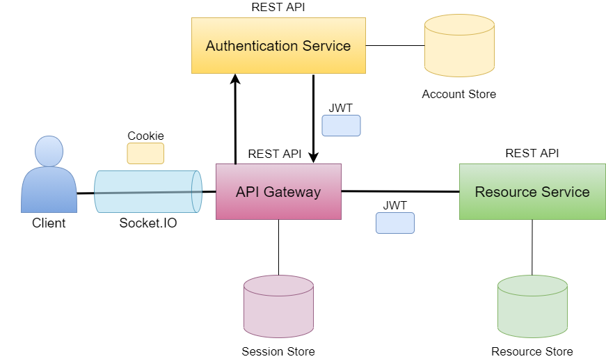

# Resource Service

A microservice to serve resources for the ChatBuds application.

## System overview
ChatBuds is built as a small microservice-architecture. The consumer/client only communicates with the API Gateway which handles the back-end communication.

The client: https://github.com/irosvall/chatbuds-client

The API Gateway: https://github.com/irosvall/chatbuds-api-gateway

The Authentication Service: https://github.com/irosvall/chatbuds-auth-service

## API documentation
The documentation of which http requests are possible to make is found at: https://app.swaggerhub.com/apis-docs/chatbuds/resource-service/1.0.0

## Starting up this project locally
To run the Resource Service locally you will need to add a .env file to the root of the project.

The .env file should contain:

- PORT= which port the Resource Service should run on
- DB_CONNECTION_STRING= the database connection string
- PUBLIC_KEY_FILEPATH= the file path to public key used for JWT decoding
- DB_CONNECTION_STRING_TEST= the database connection string used for tests

(replace the description next to "=" with its desired value)

### Enter "npm install" in the terminal to build the dependencies

## Running Resource Service
Development mode: enter "npm run start:dev" in the terminal.

Production mode: enter "npm start" in the terminal.

## Linting the code
Check for linting problems by entering "npm run lint" in the terminal.

Fix linting problems automatically by entering "npm run lint:fix" in the terminal.
